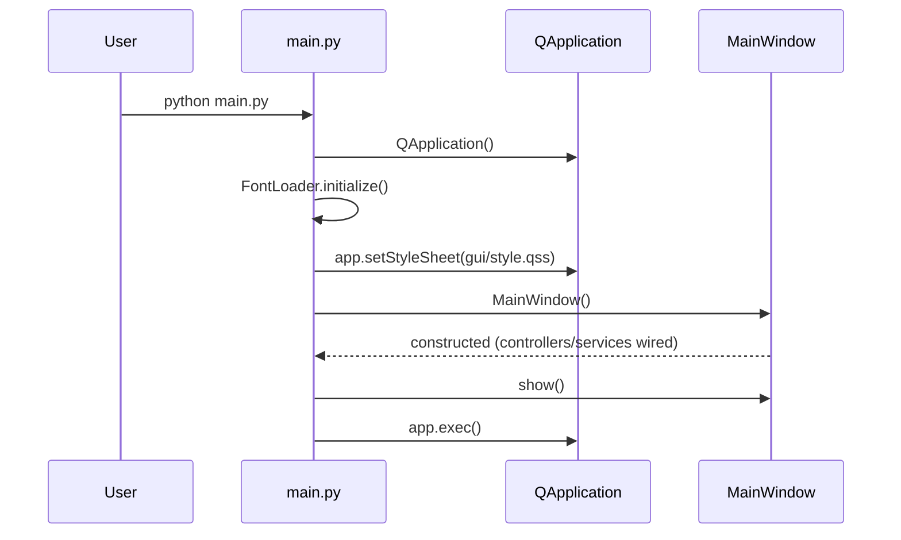
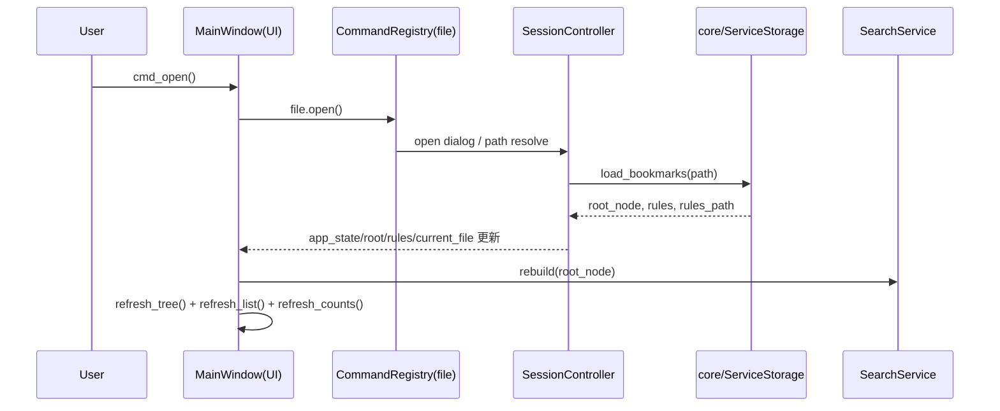
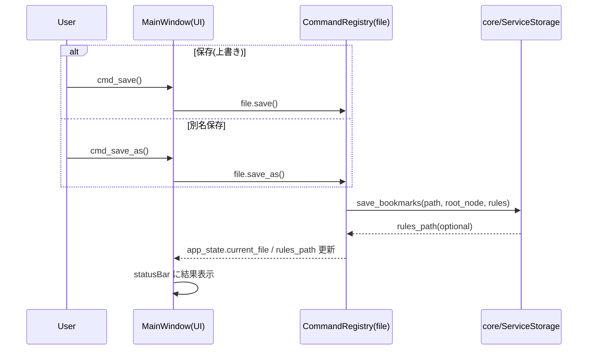
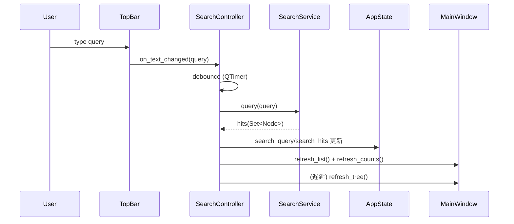
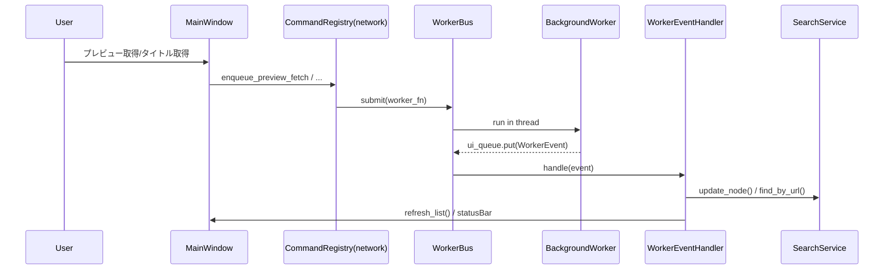

"""
Project Directory Structure and Responsibilities
==============================================

core/：純ロジック（UIに依存しない）
├── model.py          : Node, Parser, Exporter
├── storage.py        : Bookmark I/O (HTML 読み込み・保存)
├── logger.py         : ログ管理
├── utils.py          : 汎用ユーティリティ
└── font_loader.py    : フォントロード

gui/：UI層（Widget、ダイアログ）
├── main_window.py    : MainWindow (旧 app/main_window.py)
├── state.py          : AppState (統一状態管理)
├── components.py     : カスタム Widget (BookmarkCard, BookmarkRow など)
├── dialogs.py        : ダイアログ群
├── theme.py          : テーマ・色・フォント定義
├── resources.py      : リソース定数
├── style.qss         : QSS スタイルシート
└── worker_manager.py : (削除予定)

services/：ビジネスロジック・外部I/O
├── bookmark.py       : BookmarkService (木構造操作 API)
├── search.py         : SearchService (検索ロジック)
├── events.py         : Worker イベント型定義
├── workers.py        : 非同期ワーカー (preview, title fix)
├── ai_classifier.py  : AI 分類ロジック
└── legacy/           : 旧実装

tests/：ユニット・統合テスト
├── conftest.py       : テスト fixture
├── test_parser_exporter.py
├── test_search_service.py
├── test_bookmark_service.py
├── test_core.py      : 他の core テスト
├── fixtures/         : テストデータ
└── manual/           : 手動テスト

app/：起動層 (将来的には gui/main_window.py を app/ へ移管)
└── main.py           : アプリケーション起動

config/：設定ファイル
└── prompt.txt        : AI プロンプトテンプレート

docs/：ドキュメント

責務の境界
========

1. core/ は「GUIの知識を持たない」
   - PySide6 をインポートしない
   - 純粋な Python オブジェクトのみ
   - テスト時 GUI 環境不要

2. services/ は「ビジネスロジック」
   - core/ のオブジェクトを操作
   - UI からは独立
   - 外部 API 呼び出し (network, AI) を持つ

3. gui/ は「ビジネスロジックの知識を持たない」
   - service / core を呼び出すのみ
   - UI のみの責務
   - mock service で テスト可能にする

4. tests/ は「core と service を徹底テスト」
   - UI テストは最小限 (スナップショット程度)
   - 90% は ロジックテスト

Migration Plan
==============

現状：gui/ に App クラス + business logic が混在
目標：完全分離

段階的移行：
- [x] P0: AppState, SearchService, BookmarkService 作成
- [x] P1: MainWindow に service 層取り込み (互換性保つ)
- [x] P2: MainWindow 内 cmd_* を service 呼び出し に置き換え
- [x] P3: FeatureFlags 統合、全 tree 操作を BookmarkService に統一
- [ ] P4: UI テスト環境整備
- [ ] P5: 旧 logic を services/ へ完全移行

✅ **完成状況（2026-01-16）**
- 56/56 テスト成功
- 全 cmd_* メソッドが BookmarkService 経由
- FeatureFlags で機能トグル統一
- 直接 tree 操作なし（全て Service 層経由）
"""

ユーザー導線（メニュー操作 → 状態遷移 → 保存）
==============================================

このセクションは「ユーザーがUIで操作したとき、内部でどの層がどう呼ばれ、どの状態が変わり、最終的にどこへ保存されるか」を追えるようにしたものです。

注: 上段の「ディレクトリ構造」説明はリファクタ前の名残があり、現行コードの実体は `gui/controllers/`・`gui/layout/`・`services/Service*.py` などにあります。

0. 起動導線
-----------

主な責務
- `main.py`: Qt初期化/フォント/スタイル適用/ウィンドウ生成
- `MainWindow`: サービス/状態/コントローラ配線と UI 組み立て

1. ファイルを「開く」導線（メニュー/右パネル）
--------------------------------------------

ユーザー操作
- メニュー「開く」または右パネルの「開く」ボタン

内部の流れ（概略）

状態遷移（代表）
- `AppState.root_node`: 読み込んだブックマークツリーに差し替え
- `AppState.current_file`: 開いたファイルパスに更新
- `AppState.rules / rules_path`: sidecar のルールをロード

2. 「保存」導線（上書き/別名保存）
-------------------------------

ユーザー操作
- メニュー「保存」「別名保存」または右パネルの「保存」「別名保存」

内部の流れ（概略）

ポイント
- 保存先のパス決定（上書き/別名）は「コマンド層」に寄せ、`MainWindow.cmd_*` は委譲のみ。
- 実ファイル書き込みは `core/ServiceStorage.save_bookmarks()` が担当。

3. 検索導線（トップバー検索）
---------------------------

ユーザー操作
- 上部検索バーに文字入力（入力中はデバウンス）

内部の流れ（概略）

ポイント
- `SearchService` は UI 非依存（純粋にインデックス & クエリ担当）。
- `SearchController` がデバウンス/再描画タイミング調整を担当。

4. 編集導線（名前変更 / URL編集 / 移動 / 削除）
-------------------------------------------

基本パターン
- UIイベント（選択/右クリック/ボタン） → `UIEventController` → `CommandRegistry.bookmark.*` → `BookmarkService` → `AppState`/UI更新

更新の考え方
- ツリー構造が変わる操作（移動/削除/新規フォルダ等）: `refresh_tree()` が必要
- 表示だけ変わる操作（タイトル/URL更新）: `refresh_list()` 中心で十分

5. 非同期導線（プレビュー取得 / タイトル取得）
------------------------------------------

内部の流れ（概略）

導線を追うときの「入口」一覧
------------------------

- 起動: `main.py`
- UIと委譲の中心: `gui/controllers/ControllerMainWindow.py` (`MainWindow`)
- メニュー/アクション: `gui/layout/LayoutMenus.py`（MenuBuilder） + `gui/commands/*`
- 状態: `gui/ModelAppState.py`（AppState）
- 読み書き: `core/ServiceStorage.py`（load/save）
- 検索: `services/ServiceSearch.py`（SearchService） + `gui/controllers/ControllerSearch.py`
- 非同期: `services/BusWorker.py`（WorkerBus） + `services/ModelWorkerEvents.py`
